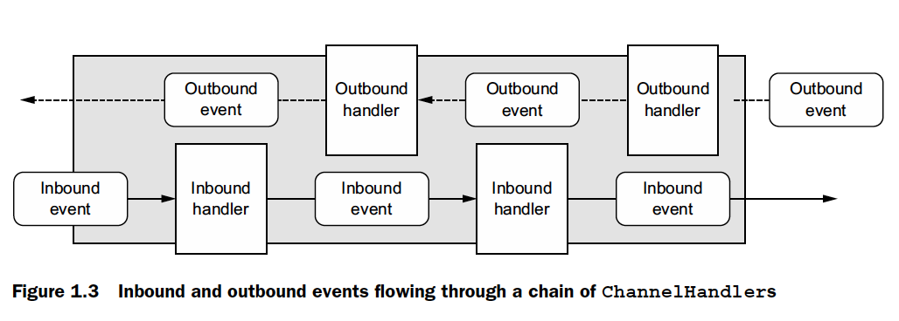

# Netty 

## Concepts

* Java OIO (Old input and output): `java.net` blocking functions from nactive system socket libraries
* Java NIO (New input and output): `java.nio` non blocking native libraries

### Selectors

* Use event notification API to indicate which nonblocking `sockets` are ready for I/O

### Core Components

* `Channel` represents an open connection to an entity

* `Callbacks` method reference provided to another method (to call back).  Callback triggered -> `<ChannelHandler>`

* `Future`: notify an application when an operation has completed. Placeholder for the result of async op. `ChannelFuture`

  ChannelFutureListener ---register--> ChannelFuture

  Notes: Callbacks and Futures are complementary mechanisms. Future is more elaborate than callbacks.

* `ChannelHandler`: pipeline of events and handlers(action for Inbound/Outbound)

### ELECTORS, EVENTS, AND EVENT LOOPS

`Selector` is abstracted away (from Channel, Future, Callbacks, ChannelHandler) to fire different events. (event management)

An `EventLoop` is assigned to each Channel to handle all of the events

* Registration of interesting events

* Dispatching events to ChannelHandlers

* Scheduling further actions